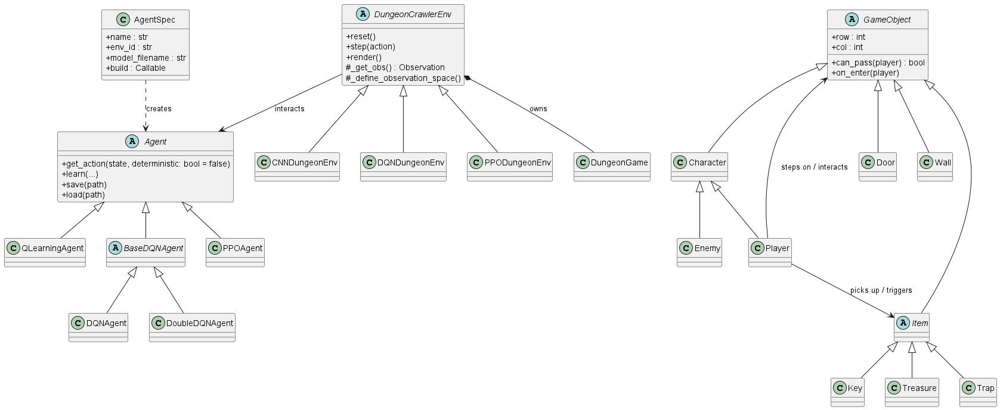

# OOP x RL Group Project


## 專案總覽 (Project Overview)

本專案分為兩個部分：
- [Frozen Lake RL Project](#1-frozen-lake-rl-project)
- [Dungeon Crawler (主要專案)](#2-dungeon-crawler-rl-project)

### 1. Frozen Lake RL Project

#### 檔案結構

位於 [`frozen_lake/`](frozen_lake/) 資料夾下：

*   **`Agent.py`**: 核心邏輯。包含 `QLearningAgent` 類別，負責 Q-Table 的更新與動作選擇。
*   **`CheatingEnv.py`**: 自定義環境。包含 `LessSlipperyFrozenLakeEnv`，提供更友善的學習環境。
*   **`main.py`**: 主程式。負責解析參數、執行訓練迴圈、評估並儲存結果。
*   **`Result/`**: 存放訓練結果圖表與數據。

#### Requirements && dependencies

請確保安裝以下 Python 套件：
```
frozen_lake
├── gymnasium v1.2.2
│   ├── cloudpickle v3.1.2
│   ├── farama-notifications v0.0.4
│   ├── numpy v2.3.5
│   └── typing-extensions v4.15.0
└── matplotlib v3.10.7
    ├── contourpy v1.3.3
    │   └── numpy v2.3.5
    ├── cycler v0.12.1
    ├── fonttools v4.61.0
    ├── kiwisolver v1.4.9
    ├── numpy v2.3.5
    ├── packaging v25.0
    ├── pillow v12.0.0
    ├── pyparsing v3.2.5
    └── python-dateutil v2.9.0.post0
        └── six v1.17.0
```
```bash
pip install -r frozen_lake/requirements.txt
```

#### 如何執行

所有操作都可以透過 `main.py` 執行，支援豐富的命令列參數 (CLI)。

##### 1. 訓練與評估

**基本指令 (預設設定)**:
```bash
python frozen_lake/main.py
```
*   預設使用 `8x8` 地圖，開啟滑動模式，並使用優化過的環境 (`cheating=True`)。

**自定義參數範例**:
在 4x4 地圖上訓練，關閉作弊模式 (使用原始 Gymnasium 環境)：
```bash
python frozen_lake/main.py \
    --map 4x4 \
    --runs 10 \
    --cheating False \
    --train_episodes 15000 \
    --eval_episodes 1000 \
    --is_slippery True \
    --render_mode ansi
```

| 參數 | 預設值 | 說明 |
| :--- | :--- | :--- |
| `--map` | 8x8 | 地圖大小 (`4x4` 或 `8x8`) |
| `--runs` | 10 | 實驗重複次數 (取平均用) |
| `--cheating` | True | 是否使用自定義的 LessSlippery 環境 |
| `--train_episodes` | 15000 | 訓練回合數 |
| `--eval_episodes` | 1000 | 評估回合數 |
| `--is_slippery` | True | 是否開啟滑動模式 |
| `--render_mode` | ansi | 渲染模式 (`ansi` 文字模式 或 `human` 視窗模式) |

##### 2. 如何查看可用的參數說明
```bash
python frozen_lake/main.py --help
```
--- 

### 2. Dungeon Crawler RL Project

#### UML 類別圖


#### 檔案結構

位於 [`dungeon_crawler/`](dungeon_crawler/) 資料夾下：

*   **`dungeon_game.py`**: 遊戲核心邏輯 (Pygame)。包含所有類別 (`GameObject`, `Player`, `Enemy` 等) 與遊戲迴圈。
*   **`dungeon_env.py`**: Gymnasium 環境封裝。將遊戲包裝成標準 RL 環境。
*   **`agent.py`**: 包含 `BaseDQNAgent`, `DQNAgent`, `DoubleDQNAgent`, `QLearningAgent` 的實作。
*   **`train.py`**: 統一的訓練與測試入口。支援命令列參數 (CLI) 來調整訓練設定。
*   **`human.py`**: 人類手動試玩腳本。

#### Requirements && Dependencies

請確保安裝以下 Python 套件：

```
dungeon_crawler
├── gymnasium v1.2.2
├── matplotlib v3.10.7
├── numpy v2.3.5
├── pygame v2.6.1
├── torch v2.9.1
└── tqdm v4.67.1
```

```bash
pip install -r dungeon_crawler/requirements.txt
```

#### 如何執行

所有操作都可以透過 `train.py` 或特定腳本執行。

##### 1. 手動試玩
親自挑戰這個 11x12 的複雜迷宮！
*   **操作**：方向鍵移動，`R` 重置，`ESC` 離開。
*   **目標**：避開怪物與陷阱 -> 拿到鑰匙 (K) -> 打開門 (D) -> 取得寶藏 (T)。

```bash
# 方法一：使用 human.py
python dungeon_crawler/human.py

# 方法二：使用 train.py
python dungeon_crawler/train.py --mode human
```

##### 2. Train Agent
讓 AI 從零開始學習。程式會顯示訓練日誌並定期儲存模型。

**基本指令**:
```bash
# 訓練 Standard DQN
python dungeon_crawler/train.py --mode train --agent DQN

# 訓練 Double DQN (推薦)
python dungeon_crawler/train.py --mode train --agent DDQN

# 訓練 Q-Learning
python dungeon_crawler/train.py --mode train --agent QLearning

# 訓練 PPO（範例）
python dungeon_crawler/train.py --mode train --agent PPO --batch 64
```

**進階參數**:
你可以透過參數調整超參數 (Hyperparameters)：
```bash
usage: train.py [-h] [--agent {QLearning,DDQN,DQN,PPO}] [--episodes EPISODES] [--mode {train,test,eval,human}] [--learning_rate LEARNING_RATE] [--gamma GAMMA] [--epsilon EPSILON]
                                [--epsilon_decay EPSILON_DECAY] [--min_epsilon MIN_EPSILON] [--batch BATCH] [--memory MEMORY] [--target_update_freq TARGET_UPDATE_FREQ] [--gae_lambda GAE_LAMBDA]
                                [--policy_clip POLICY_CLIP] [--n_epochs N_EPOCHS]
                options:
  -h, --help                                -> show this help message and exit
  --agent {QLearning,DDQN,DQN,PPO}          -> Type of agent to use
  --episodes EPISODES                       -> Number of episodes to train
  --mode {train,test,eval,human}            -> Mode to run the agent 
  --learning_rate LEARNING_RATE             -> Learning rate
  --gamma GAMMA                             -> Discount factor
  --epsilon EPSILON                         -> Initial epsilon
  --epsilon_decay EPSILON_DECAY             -> Epsilon decay rate
  --min_epsilon MIN_EPSILON                 -> Minimum epsilon
  --batch BATCH                             -> Batch size
  --memory MEMORY                           -> Memory size
  --target_update_freq TARGET_UPDATE_FREQ   -> Target update frequency
  --gae_lambda GAE_LAMBDA                   -> (PPO) GAE lambda
  --policy_clip POLICY_CLIP                 -> (PPO) Clip epsilon
  --n_epochs N_EPOCHS                       -> (PPO) Epochs per update
```

| 參數 | 預設值 | 說明 |
| :--- | :--- | :--- |
| `--agent` | DQN | 選擇 Agent 類型 (`DQN`, `DDQN`, `QLearning`, `PPO`) |
| `--episodes` | 2000 | 訓練總回合數 |
| `--mode` | train | 選擇模式 (`train`, `test`, `eval`, `human`) |
| `--learning_rate` | 0.00025 | 學習率 |
| `--gamma` | 0.99 | 折扣因子 (Discount Factor) |
| `--epsilon` | 1.0 | 初始 epsilon (DQN 系列使用) |
| `--epsilon_decay` | 0.998 | Epsilon 退火率 |
| `--min_epsilon` | 0.05 | 最小 epsilon |
| `--batch` | 512 | 批量大小 (Batch Size) |
| `--memory` | 50000 | 變換記憶體大小 |
| `--target_update_freq` | 1000 | Target Network 更新頻率；PPO 則是 update_interval |
| `--gae_lambda` | 0.95 | (PPO) GAE lambda |
| `--policy_clip` | 0.2 | (PPO) Clip epsilon |
| `--n_epochs` | 10 | (PPO) 每次更新的 epoch 數 |

##### 3. Test Agent
載入訓練好的模型 (`final_model`) 並觀看 AI 實際遊玩。

```bash
python dungeon_crawler/train.py --mode test --agent DDQN
```
*   注意：測試模式會讀取 `dungeon_crawler/Result/{agent}/result/final_model.pth`，請先確保訓練完成。

##### 4. 評估模型
使用確定性策略（貪婪動作）跑多個 episodes，計算平均與標準差，適合比較不同超參或演算法的最終表現。

```bash
# 評估 PPO，跑 50 回合（預設）
python dungeon_crawler/train.py --mode eval --agent PPO --episodes 50

# 也可套用到其他 agent（會使用各自的貪婪策略）
python dungeon_crawler/train.py --mode eval --agent DQN --episodes 50
```

*   輸出格式：`Mean Reward: <平均> ± <標準差>`。
*   PPO 評估使用 `deterministic=True`，避免訓練時的探索噪音。

---

## Contribution List

| 組員 | 學號 | Github username | 負責項目 |
|------|------|--------|---------------------|
| 徐子皓 | B124040036 | HaoHao041003 | Frozen Lake optimization/utilities, Dungeon Crawler CNN/DQN agent, reflection report|
| 陳彥維 | B123040039 | Shuaige0709 | Dungeon Crawler PPO agent, eval mode, AgentSpec class, UML, demo slide|
| 李承諺 | B123040032 | Mr-Tony-Lee | Frozen Lake project, Dungeon Crawler environment, items, game, Q-Learning/DDQN agent, parser, train/test mode |
